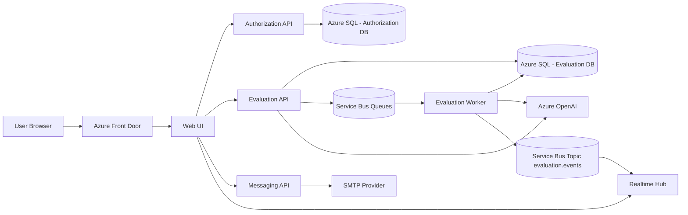

# CommunicationProfiler — System Architecture

This repository documents the architecture of CommunicationProfiler, an AI-powered platform designed and built end-to-end as an independent product initiative.

CommunicationProfiler is an AI-powered communication intelligence platform built as a set of clean-architecture services on Azure. This document summarizes the runtime, infrastructure, and operational view with a platform-engineering focus.

The system separates synchronous user interaction from LLM-heavy processing using an event-driven architecture built on Azure Service Bus and dedicated background workers.

This platform was designed and implemented end-to-end, including:
- system architecture
- infrastructure design (Bicep)
- distributed processing model
- AI integration workflows
- deployment automation
- observability setup

Key architectural goals:
- latency isolation for AI workloads
- independent service scalability
- realtime evaluation feedback
- cloud-native deployment automation

## Live Platform
CommunicationProfiler is currently running in **Live Open Beta**.

## Platform Summary
- Domain: 12D communication analysis, candidate and role profiling, feedback collection.
- Stack: .NET 9 microservices, React + Vite + TypeScript web UI.
- Runtime model: synchronous APIs plus asynchronous queue-based workers and realtime updates via SignalR.
- Infrastructure: Azure App Service, Azure SQL, Service Bus, Azure OpenAI, Key Vault, App Configuration, Application Insights, Storage, Front Door.

## Project Inventory
| Project | Runtime | Responsibility | Integrations | Deployable Units |
| --- | --- | --- | --- | --- |
| `CommunicationProfiler.Evaluation.Service` | .NET 9 | Core evaluation domain. API for reports, questions, role profiles, candidate profiles. Worker for async evaluation processing. Realtime worker for SignalR updates. | Azure SQL, Azure Service Bus, Azure OpenAI, Application Insights | API App Service (Linux), Worker App Service (Windows), Realtime App Service (Linux) |
| `CommunicationProfiler.Authorization.Service` | .NET 9 | Auth and user stage management (register, login, stage updates). Clean Architecture with EF Core and hashing. | Azure SQL, Application Insights | Auth API App Service (Linux) |
| `CommunicationProfiler.Messaging.Service` | .NET 9 | Feedback submission API with SMTP email delivery. Worker and realtime projects are currently minimal placeholders. | SMTP provider, Application Insights | Messaging API App Service (Linux) |
| `CommunicationProfiler.Web` | React 18 + Vite | Web UI for 12D assessment, reporting, and dashboards. | Evaluation API, Auth API, Messaging API, SignalR hub | Web App Service or Storage static site |
| `CommunicationProfiler.Evaluation.Infrastructure` | Bicep + PowerShell | Infrastructure as Code and deployment orchestration. | Azure App Service, SQL, Service Bus, OpenAI, Key Vault, App Config, Front Door, Storage | Resource group deployment |
| `CommunicationProfiler.Architecture` | Markdown | Architecture and platform documentation. | - | Documentation only |

## Service Endpoints (HTTP)
### Evaluation API
- `POST /api/TwelfDimensions/evaluate`
- `GET /api/Questions?language=...`
- `GET /api/EvaluationReports`
- `GET /api/EvaluationReports/{reportId}`
- `POST /api/RoleProfile/draft`
- `POST /api/RoleProfile/enhance`
- `POST /api/CandidateProfile/candidate-report`

### Authorization API
- `POST /api/auth/register`
- `POST /api/auth/login`
- `POST /api/auth/user-stage`

### Messaging API
- `POST /api/feedback` (multipart/form-data)

### Realtime Hub
- `/hubs/evaluation-events?userId=...`

## Runtime Flow

## Architectural Decisions
The platform architecture was designed around several key constraints:

- AI evaluation workloads are latency-intensive and unpredictable,
  therefore execution is fully decoupled from HTTP request handling.
- Background workers process LLM operations asynchronously via Azure Service Bus,
  preventing API saturation and improving user responsiveness.
- Independent App Service plans allow horizontal scaling of compute-heavy
  components without affecting authentication or messaging services.
- Realtime SignalR updates provide continuous feedback during long-running
  evaluation workflows.

## Architectural Trade-offs
The following trade-offs were intentionally accepted:

- Event-driven processing increases operational complexity
  but provides strong isolation for unpredictable AI workloads.
- Multiple App Service plans introduce higher infrastructure cost
  in exchange for independent scaling and failure containment.
- EF Core migrations executed at startup simplify deployments,
  while production environments may require controlled migration pipelines.
- SignalR realtime updates introduce additional infrastructure coupling,
  but significantly improve user experience during long-running evaluations.

## System Constraints
The architecture was designed under the following constraints:

- AI evaluations may take several seconds to minutes.
- User interaction must remain responsive during processing.
- Services must scale independently under unpredictable workloads.
- Infrastructure must support iterative product evolution without downtime.

## Evaluation Service Details
- API controllers
- `TwelfDimensionsController`: queues evaluation jobs, supports cancel/resume/delete.
- `QuestionsController`: serves localized question sets.
- `EvaluationReportsController`: report list and details.
- `RoleProfileController`: draft and enhance job profiles.
- `CandidateProfileController`: candidate report queue and retrieval.
- Worker
- Listens to Service Bus queues and executes LLM-backed evaluation workflows.
- Publishes status events to Service Bus topic for realtime UI updates.
- Realtime Worker
- SignalR hub at `/hubs/evaluation-events`.
- Consumes Service Bus topic subscription `realtime`.
- Data
- SQL Server database `cp-evaluation` with EF Core migrations executed at startup.

## Authorization Service Details
- API endpoints: register, login, update user stage.
- EF Core with SQL Server database `cp-authorization`.
- Password hashing uses Blake2 with per-user salt.
- Migrations executed at startup.

## Messaging Service Details
- Feedback API accepts multipart form with optional attachments.
- SMTP-backed delivery with MailKit.
- No database dependency in current implementation.

## Web UI Details
- React + Vite + TypeScript, TailwindCSS, shadcn/ui, Zustand.
- Environment-driven endpoints used at build time
- `VITE_SAGA_API_BASE_URL`
- `VITE_AUTH_API_BASE_URL`
- `VITE_MESSAGING_API_BASE_URL`
- `VITE_HUB_BASE_URL`

## Infrastructure (Bicep)
Primary template: `CommunicationProfiler.Evaluation.Infrastructure/Bicep/main.bicep`
- App Service plans for API, Auth, Messaging, Worker, Realtime, and Web (independent scaling).
- App Services use system-assigned managed identity and HTTPS-only.
- SQL Server with two databases: `cp-evaluation`, `cp-authorization`.
- Service Bus namespace with queues and topic
- Queues: `evaluation-requests`, `profile-requests`, `candidate-requests`.
- Topic: `evaluation.events` with subscription `realtime`.
- Azure OpenAI account with main and privacy deployments (configurable).
- Application Insights per service.
- Key Vault for secrets, optionally using RBAC.
- App Configuration for shared settings and environment labeling.
- Storage account for static web hosting.
- Front Door for path-based routing to `/communication-profiler` and optional root origin.

## Configuration and Secrets
- Secrets are intended to be stored in Key Vault and referenced in App Service settings.
- App Configuration is used by CI/CD workflows to resolve app names, endpoints, and CORS hosts.
- Some `appsettings.json` files include sample values. Treat them as local-only and avoid committing real secrets.

## CI/CD and Deployment
- GitHub Actions workflows per service
- `Evaluation.Service` builds API, Worker, and Realtime, then deploys to separate App Services.
- `Authorization.Service` deploys auth API and applies Key Vault connection string reference.
- `Messaging.Service` deploys API and injects SMTP settings via Key Vault.
- `Web` workflow resolves endpoints from App Configuration, sets VITE_* variables, builds and deploys.
- PowerShell deployment scripts
- `CommunicationProfiler.Evaluation.Infrastructure/scripts/deploy.ps1` orchestrates infra and service deploys.
- Service-level `scripts/deploy.ps1` handle zip deploys and app settings.

## Observability and Operations
- Application Insights per service for traces and metrics.
- App Service logs configured in Bicep.
- CORS host allow-lists configured per service.
- Service Bus decouples LLM-heavy workloads from the request path.

## Platform Engineer Notes
- Each service is an independent deployable unit with its own App Service plan.
- Async processing via Service Bus and dedicated worker improves latency isolation.
- SignalR realtime channel provides user-facing job status updates.
- EF Core migrations run at startup; in production, consider a controlled migration step to reduce startup risk.
